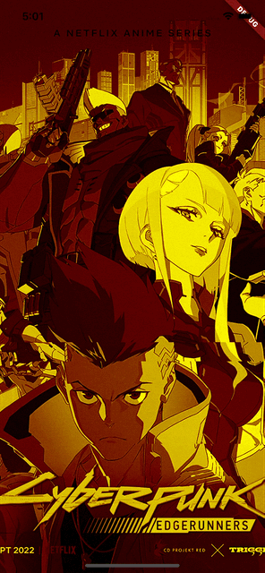

#### Color filters
You can provide specific color filters that will be applied before the `ColorChannels` are shifted:

```dart
return Scaffold(
  body: AnimatedGlitch(
    filters: const [
      GlitchColorFilter(
        blendMode: BlendMode.color,
        color: Colors.grey,
      ),
      GlitchColorFilter(
        blendMode: BlendMode.colorBurn,
        color: Colors.orange,
      )
    ],
    controller: _controller,
    child: Image.asset(
      'assets/cyberpunk.jpg',
      fit: BoxFit.cover,
    ),
  ),
);
```

Output:
<a>
    
</a>